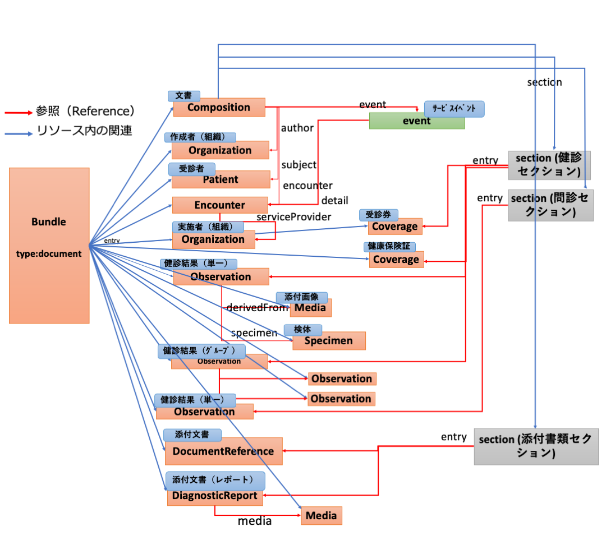
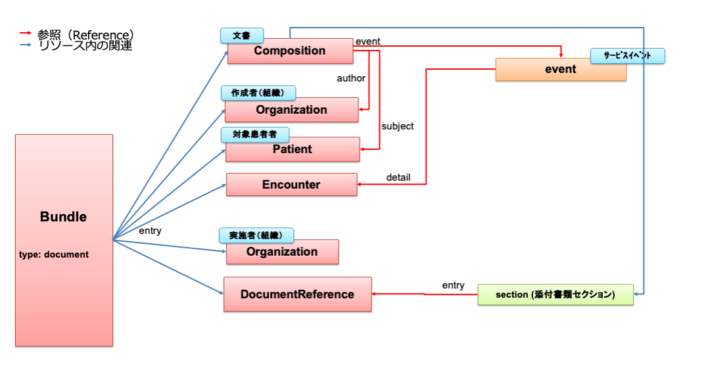

  <style type="text/css">

table {
  border: solid 1px black;
  border-collapse: collapse;
}

table td {
  border: solid 1px black;

}
table th {
  border: solid 1px black;

}
    h1 {
      counter-reset: chapter;
    }

    h2 {
      counter-reset: sub-chapter;
    }

    h3 {
      counter-reset: section;
    }

    h4 {
      counter-reset: sub-section;
    }

    h5 {
      counter-reset: composite;
    }

    h6 {
      counter-reset: sub-composite;
    }

    h1:before {
      color: black;
      counter-increment: bchapter;
      content:  " ";
    }

    h2:before {
      color: black;
      counter-increment: chapter;
      content: counter(chapter) ". ";
    }

    h3:before {
      color: black;
      counter-increment: sub-chapter;
      content: counter(chapter) "."counter(sub-chapter) ". ";
    }


    h4:before {
      color: black;
      counter-increment: section;
      content: counter(chapter) "."counter(sub-chapter) "."counter(section) " ";
    }

    h5:before {
      color: black;
      counter-increment: sub-section;
      content: counter(chapter) "."counter(sub-chapter) "."counter(section) "."counter(sub-section) " ";
    }

    h6:before {
      color: black;
      counter-increment: sub-sub-section;
      content: "　　"counter(sub-sub-section) "）";
    }
</style>

厚生労働科学研究費補助金事業
「検診情報と栄養情報の標準的なデータ項目・様式・交換方式をFHIR準拠仕様として開発する研究」研究班
2022年3月


# **健診結果報告書HL7 FHIR記述仕様 第1.1版**

### 本文書の位置づけと適用範囲について
この仕様書は、HL7 FHIR（以下、単に「FHIR 」という）に準拠した自治体検診の検診結果報告書（以下、単に「検診結果」または「検診結果報告書」という）の記述仕様の文書である。

令和2年度厚生労働行政推進調査事業費補助金 令和2年度厚生労働科学特別研究事業「診療情報提供書, 退院時サマリー等の電子化医療文書の相互運用性確保のための標準規格の開発研究」 (課題番号20ⅭＡ2013）（以下、単に「R2厚生科研研究班」という）の成果物を、その作成者らが編集したものである。

以下では本仕様書という。

本仕様書は、「日本医療情報学会　健康診断結果報告書HL7 FHIR記述仕様　第1版」（以下、FHIR健診結果報告書規格と呼ぶ）を参考にして、 FHIRに準拠した記述仕様として作成されている。

また、本仕様書の作成にあたって、ベースとしたFHIR 仕様には、FHIR R4に修正を加えたVer. 4.0.1(Oct-30, 2019)を採用しているが、それ自体がNormative（標準） として確定した仕様となっていないものを多く含んでいる。そのため、元となるFHIR仕様が変更されることがあるが、本仕様書の明示的な改版時まではその変更の影響を受けないものとする。

本仕様書が想定する適用範囲は、
・　特定健康診査（特定健診）
・　特定健診以外の事業による健診（広域連合の保健事業における健診）
・　労働安全衛生法に基づく事業者健診の一般健診（特殊健診は含まない）
・　人間ドック
・　検診（特定の疾患を対象とするもの。自治体検診を含む）
・　その他の検診
における結果の提供である。

ただし、制度として、健診実施機関が保険者等の制度実施主体に対して電子的に提出する規格を別に定めている場合にはその仕様に従うことを優先する。従って、本仕様書を「高齢者の医療の確保に関する法律（昭和57年法律第80号）」に規定する特定健診の結果を健診実施機関が保険者等に対して電子的に提出する際に使用するための電子的なデータ標準様式として使うかどうかは、関係法令や通知に従う。

本仕様書には検体検査、生理検査、波形情報、放射線等の画像情報など付帯情報を添付する際の規格が含まれているが、カルテあるいは各種サマリー等の内容に関する規格は含まれていない。

問診結果データは通常の健康診断結果報告書では受診者へ提供されないが、特定健診では管理データとなって保管され、人間ドック等としても重要な情報として管理されていることが一般的であり、本仕様書では一般の問診項目も含めて受診者等へ結果報告が可能な仕様とした。この仕様を利用するかどうかは運用者の判断に委ねられる。

また本仕様書が定める健康診断結果報告書の提供手段、管理方法、利用法については別規格などに委ね、本仕様書の範囲ではない。

また、それぞれの健診に対して個別に詳細規格が法令や通知、あるいは事業運用者などで定められている場合はそちらを優先する。


## 参照仕様および用語
### 参照仕様

* HL7FHIR R4 Ver.4.0.1 [[http://hl7.org/fhir/index.html](http://hl7.org/fhir/index.html)]　 本仕様書ではFHIR基底仕様という。
* HL7 FHIR JP CORE 実装ガイド  [[https://jpfhir.jp/fhir/core/index.html](https://jpfhir.jp/fhir/core/index.html)]
* 日本医療情報学会　健康診断結果報告書FHIR記述仕様 第1版
[[https://std.jpfhir.jp/wp-content/uploads/std/eCheckup.pdf](https://std.jpfhir.jp/wp-content/uploads/std/eCheckup.pdf)]<br>本仕様書では、FHIR健診結果報告書規格と呼ぶ。
* 特定健診・特定保健指導の電子的なデータ標準様式 3-1A 特定健診情報ファイル（健診・保健指導機関等→医療保険者）仕様説明書 Version4
[https://www.mhlw.go.jp/stf/seisakunitsuite/bunya/xml_30799.html]

* 特定健康診査・特定保健指導の電子的な標準様式の仕様に関する資料より
	付属1　「OID(オブジェクトＩＤ）表」
	付属2　「XML用特定健診項目情報」
　　[https://www.mhlw.go.jp/stf/seisakunitsuite/bunya/xml_30799.html]
* JAHIS 18-007 健康診断結果報告書規格 Ver.2.0
[https://www.jahis.jp/standard/detail/id=659]
* 厚生労働省　健（検）診結果の利活用に向けた情報標準化整備事業について 自治体検診結果用フォーマット（令和４年２月17日更新）
[https://www.mhlw.go.jp/stf/seisakunitsuite/bunya/kenkou_iryou/kenkou/seikatsu/index.html]


### 用語と定義
#### FHIRリソース
HL7 FHIRにおいて、「患者」や「医師」、「検査」、「診察」といった、ヘルスケアに関連する「ビジネスオブジェクト」のデータ要素、制約、および関係を定義した情報モデルの集合を「リソース」と呼ぶ。リソースは、FHIRで定義される全ての情報交換の構成要素として利用される。

#### 報告・提出・提供
CDA健診結果報告書規格に準じて、法律によって報告が義務付けられている報告を「提出」、任意に個人の要求により報告するものを「提供」とした。両者を区別しない場合は「報告」とした。

#### 検査区分
健診では、身体計測情報、血圧等情報、肝機能、腎機能等の様に幾つかの検査項目を機能別にまとめて判定を行う場合が多い。このように複数のデータ項目をまとめたものをCDA健診結果報告書規格に準じて「検査区分」と呼ぶ。
厚生労働省が公表している「特定健診項目コード表」では「区分番号」および「区分名称」が記述されている。人間ドック等では健診実施機関により項目のまとめ方が異なるため、「特定健診項目コード表」とは別の「区分名称」も例示している。それ以外に、必要があれば各健診実施機関等でも独自に検査区分を定義して使用することができる。

### 記号及び略語

* HL7 : Health Level Seven
* CDA R2：Clinical Document Architecture Release 2
* FHIR : Fast Healthcare Interoperability Resources
* DICOM : Digital Imaging and Communications in Medicine
* MFER : Medical waveform Format Encoding Rules

## 概要
本仕様書は、自治体検診の検診結果報告書を電子的に記述するため、HL7 FHIR に基づいて定めるものである。

### 文書構造
文書構造は、document type のCDA健診結果報告書規格となるべく対応関係を持たせるために、FHIR BundleリソースDocument を使用し以下の構造とする。図 *1*に文書構造の概要を示す。

受診者や作成者など健診（検診）情報管理を記述する文書ヘッダに相当する部分、肺がん健診をはじめとする各種制度に基づく健診（検診）結果を記述する検査結果セクションと問診結果セクション、及び、添付書類を外部ファイルとして管理する添付書類セクションからなる。

検査結果セクションと問診結果セクションは、検診結果の作成者（情報ソース）が受診者本人かどうかによって使い分ける。つまり、受診者本人より作成されるものを問診結果セクションに格納し、それ以外の健診項目を検査結果セクションに格納する。

添付書類セクションは、DICOMファイル、波形ファイル、JPEG等の画像ファイル、PDFファイル、XMLファイル等を外部ファイルとし、そのファイルへのリンク情報やハッシュ値からなる。

また、検診結果報告書の全ての内容をFHIRリソースで構造的に記述する（本仕様書では「FHIR構造パターン」という）のではなく、CDA健診結果報告書規格に従うCDA R2形式のXMLファイルを、本文書の添付書類としてFHIRリソース中に直接含むこと（本仕様では「CDA添付パターン」という）も可能にする。その場合は、検査結果セクション、問診結果セクションは使用せず、添付書類セクションのみが使用される。図 *2* に、CDA R2形式のXMLファイル（CDA R2形式など）をそのまま添付書類セクションに含む場合の文書構造の概要を示す。

なお、この方法での記述（「CDA添付パターン」）は、ほとんどの情報がFHIRの構造形式ではなくCDA　R２形式となるため、FHIRによる記述とはみなされず、データを受領されないことがあるので、「CDA添付パターン」での記述でもよいかについて運用者に必ず確認することが必要である。

<br clear="all">
図 1  「FHIR構造パターン」文書構造の概要（FHIRリソースで構造化する場合）

<br clear="all">
図 2 「CDA添付パターン」文書構造の概要（CDA R2形式のXMLファイルを添付して使用する場合）

### 健康診断結果報告書の識別
#### <a id="report-type"></a>報告区分コード
FHIR Compositionリソースのcategory要素に指定する報告区分コードは、以下とする。本区分コードは、ファイルを作成し報告する「報告事由」の意味で使用する。

ひとつの報告文書で複数の報告区分の報告をすることはできないので、同時に複数の報告区分の報告をしたい場合には、それぞれを異なる報告文書ファイルとして作成するものとする。
<br>
•	10："特定健診" 　- 　特定健診で実施した健診結果の報告（報告：提出または提供、以下同じ）<br>
•	40："健診結果報告" -　特定健診以外の健診結果の報告（42以降の区別をつけずに報告する場合）<br>
•	41："事業者健診" 　-　事業者健診（労働安全衛生法に基づく健診）で実施した健診結果の報告<br>
•	42："自治体検診"<br>
•	43："乳幼児検診"<br>
•	44: "妊婦検診"<br>
•	90："その他検診"  （他にあてはまらない場合）<br>
<br>
報告区分コードのコード体系を示す Coding.system 要素には、コード10,40,90 の場合にはurn:oid:1.2.392.200119.6.1001、それ以外のコードの場合にはhttp://jpfhir.jp/fhir/eCheckup/CodeSystem/checkup-report-category　を使用する。


#### 健診プログラムサービスコード
FHIR Compositionリソースの Composition.event.codeは、健診プログラムサービスコードとし、健診実施時（検診実施時）にどのような区分として実施されたかを示す。以下のいずれかの目的で実施された健診（検診）によってデータが得られたかについての情報を、FHIR Compositionリソースの Composition.event.code[0]に、健診プログラムサービスコード（あるいは検診区分）で記述する 。

なお、複数の健診事業を共同で実施する場合には、特定健診以外の最も主たる健診事業のコードを記述するか、複数の event 要素を用いて記述する。

電子ファイル作成を入力機関が代行する場合などで、実施事業がこの情報が不明な場合には「000（不明）」を設定する。必須の健診結果が格納されているかどうかを判定するために必要となる情報である。
<br>
•	000：不明（以下のどの事業であるか不明な場合）<br>
•	010：特定健診<br>
•	020：広域連合の保健事業<br>
•	030：事業者健診（労働安全衛生法に基づく健診）<br>
•	040：学校健診（学校保健安全法に基づく職員健診）<br>
•	060：がん検診<br>
•	090：肝炎検診<br>
•	990：上記ではない健診（検診）<br>
<br>

コード体系を表すCoding.systemに関しては、"urn:oid:1.2.392.200119.6.1002"を使用する。

なお、プログラムサービスが、がん検診＞乳がん検診＞乳がん精密検診　のように階層的になっている区分を記述したい場合には、Composition.event.code[0]に、健診プログラムサービスコード、Composition.event.code[1]に次の階層（この例では、乳がん検診のコード）、Composition.event.code[2]にその次の階層（この例では、乳がん精密検診のコード）、のように同一のComposition.eventの下のcode要素を繰り返して記述することができおるが、それぞれの健診プログラムサービスコードのsystem値、コード表は本仕様では定義していない。


#### 受診形態の識別コード
個別受診か集合受診かの形態区別を記述したい場合には、FHIR Encounterリソースの Encounter.serviceType.coding　を使用し、コード体系を表すCoding.systemには、”http://jpfhir.jp/fhir/eCheckup/CodeSystem/checkup-encounter-type” を使用する。

<br>
•	1：個別受診<br>
•	2：集団受診<br>
<br>

#### 健康診断結果記述セクション識別コード

健診結果診断記述文書は、以下のセクションのリストから、ひとつの検査結果セクション、０個またはひとつの問診結果セクション、０個またはひとつの添付書類セクションから構成し、対応するセクションコードを使用する。ただし、CDA添付パターンで記述する場合には、検査結果セクションと問診結果セクションは存在せず、ひとつの添付書類セクションだけで構成される。

<br>
•	特定健診結果の報告の場合<br>
01011    特定健診検査結果セクション<br>
01012    特定健診問診結果セクション<br>
01990    特定健診任意追加項目セクション<br>
<br>
•	広域連合保健事業結果の報告の場合<br>
01021    広域連合保健事業検査結果セクション<br>
01022    広域連合保健事業問診結果セクション<br>
<br>
•	事業者健診結果の報告の場合<br>
01031    事業者健診検査結果セクション<br>
01032    事業者健診問診結果セクション<br>
<br>
•	その他の健診、検診の報告の場合<br>
01910    検査結果セクション<br>
01920    問診結果セクション<br>
<br>
•	すべての報告に共通するセクション<br>
01995    添付書類セクション<br>
<br>

特定健診の電子的なデータ標準様式、及び、CDA健診結果報告書規格とはセクションの使用方法が異なることに注意する。検査結果セクションと問診結果セクションの使い分けは、2.1「文書構造」で説明した通り、健診受診者本人が作成（回答）した結果か否かで決定される。コード体系を表すCoding.systemに関しては、"http://jpfhir.jp/fhir/eCheckup/CodeSystem/section-code" を使用する。特定健診の結果情報を健診実施機関が保険者等に対して電子的に提出する際にも、これを使用すること。
XMLによる特定健診報告制度で用いるCDA セクションコード(OID= 1.2.392.200119.6.1010)は使用しない。


XMLによる特定健診報告制度では、01010 特定健診検査・問診セクション、01020 広域連合保健事業セクション、01030 労働安全衛生法検査結果セクションを用いることになっているが、本仕様では、検査結果と問診結果を別々のセクションに格納することとしているので、これらのセクションコードは用いず、これらを分離した本仕様でのセクションコードを使用する。


#### ヘッダ部報告区分コードとボディ部セクション識別コードとの関係
労働安全衛生法（以下、労安法）に基づく健診や学校保健安全法に基づく職員健診、任意の人間ドック等の健診（以下、任意健診）など、種々の健診結果を報告する場合に本仕様書を使用することができる。
一般に健診実施機関が労安法に基づく健診を行う場合には、その健診において特定健診項目をすべて含むように実施されることが想定される。こうした状況において、健診実施機関からの電子的なファイル作成による報告には、次の2つの報告形態が想定される。


① 健診実施機関は、保険者に提出する特定健診情報ファイルを「高齢者の医療の確保に関する法律（昭和57年法律第80号）」に基づいて特定健診分を作成・提出する（特定健診分）ほか、それとは別に、健診委託元（事業者等）にすべての健診項目の結果を含めた健診情報ファイル（たとえば労安法分）を本仕様書に準拠して別々のファイルとして作成し提出する。


② 健診実施機関は、健診委託元（事業者等）にすべての健診項目の結果を含めた健診情報ファイルをひとつだけ本仕様書に準拠して作成し、健診委託元（事業者等）に提出する。提出を受けた健診委託元（事業者等）はこの健診情報ファイルを加工処理し、保険者に提出する特定健診情報ファイル（特定健診分）を保険者に「高齢者の医療の確保に関する法律（昭和57年法律第80号）」に基づいて作成・提出する。この場合において、加工処理を代行機関に委託することもあり得る。


CDA健診結果報告書規格においては、この２つの報告形態をひとつの報告書ファイルでサポートしているが、本仕様書では、ドキュメントの二次利用における利便性を考慮し、①の方法での報告形態のみをサポートするものとする。


同一の検査項目の結果が同じファイルの異なるセクションに重複して現れる場合、受信側は報告区分コードに従いその報告区分に対応するセクションに格納されているデータを優先的に処理し、それとは異なるセクションに出現する同一健診項目のデータは無視することを想定している。従って、仮に異なる結果が格納されていてもこのルールにより結果は一通りに定められる。


## 記述規格
### 健診結果報告書FHIR記述仕様の全体構成
#### FHIR Document
FHIR において、診療文書は、**Bundle**リソースを使用したFHIR Documentを使用して表現される。FHIR Documentは、**Bundle**リソースのtype要素値を"document"に設定した、**Bundle**リソースの種類の１つである。本仕様書では、一人の受診者に対する健康診断結果報告書を、FHIR Documentとして**Bundle**リソースにより記述する。


#### FHIR Documentの構成
FHIR Documentでは、entry要素内に resource要素を繰り返す基本構造をとり、最初のresourceは、**Composition**リソースであることとなっている。**Composition**リソースは、診療文書のヘッダ情報の位置付けとなり、この文書に含まれるリソース（情報単位）への参照を列挙し、いわば構成リソースの目次のような役割を果たす。

本仕様書で＜表 *1* Bundleリソースの記述仕様＞のような基本構造をとる。

Bundlleリソースのインスタンスデータを識別するためのIDとして、identifier要素に次の仕様でsystem とvalueを記述する。

1. 本仕様で記述したFHIRドキュメントを電子カルテ情報共有サービスに送信する場合：　
system = "http://jpfhir.jp/fhir/clins/bundle-identifier"
value = "保険医療機関番号10桁＾被保険者個人識別子＾医療機関内で一意に識別できる粒度の報告ID文字列"
この仕様の詳細は、電子カルテ共有サービスでの[報告単位識別ID]と仕様と同一であり、その仕様を参照されたい。

2. 電子カルテ情報共有サービスに送信しない場合：
system = "http://jpfhir.jp/fhir/core/IdSystem/documentInstance-identifier"
value = "保険医療機関番号10桁＾医療機関内で一意に識別できる粒度の報告ID文字列"
この仕様は、１）でのvalue値の被保険者個人識別子とひとつの区切り文字（ハット記号）を削除したものである。
	
電子カルテ情報共有サービスに送信する段階で、2）の仕様で作成されたBundleデータのidentifierは、1)の仕様のidentifierに置き換える必要がある。


> [表1 Bundleリソースの記述仕様] PDF仕様書参照のこと。


#### Compositionリソース
**Composition**リソースは、検診結果報告書FHIR documentにentry として格納される複数のリソースのうちの最初に出現するもので、この文書全体の構成目次に相当する情報や、セクションの構成を記述したものである。

検診結果報告書は、2.1「文書構造」で述べるように、検診項目、及び、問診項目を格納するセクション、及び、添付文書を格納する添付文書セクションから構成される。

>[表2 Compositionリソースの記述仕様] PDF仕様書参照のこと。


##### identifier：任意項目（0..1）

Composition.identifier 要素には、健康診断結果報告書作成機関が発行した報告書をその施設において一意に識別するID（健康診断結果報告書ID）を設定する。


```JSON
"identifier": {
    "system": "http://jpfhir.jp/fhir/core/IdSystem/resourceInstance-identifier",　
    "value": "1311234567-2020-00123456"　　←例にすぎない
}
```

健康診断結果報告書ID体系OIDとして、施設OIDをルートとする健康診断結果報告書個別ID発行規定OIDを施設ごとに決め、その規定にそった健康診断結果報告書個別IDをvalue要素に記述する方法で行う。この場合には、Identifier型のsystem要素には、urn:oid:1.2.392.200119.6.102.1[保険医療機関番号、または特定健診医療機関登録番号１０桁] を使用する。


　なお、上記の例のように施設固有のID設定方式を用いて構わないが、Identifier型のvalue要素に、保険医療機関番号（10桁）、発行年（4桁）、施設内において発行年内で一意となる番号（8桁）をハイフン(“-”：U+002D)で連結した文字列を指定する方法を本仕様書では具体例として採用している。


例：”1311234567-2020-00123456”

この仕様に準拠する場合には、Identifier型のsystem要素には、"http://jpfhir.jp/fhir/core/IdSystem/resourceInstance-identifier”を指定する。
Conpositionリソースのidentifierは繰り返しによる複数記述が可能であるため、上記の2方式で記述したidentifierを両方格納することもできる。


##### type：必須項目（1..1）
文書区分コードを規定する。
coding.code要素には　"53576-5"　を用いる。coding.system要素は"http://jpfhir.jp/fhir/Common/CodeSystem/doc-typecodes"となる。coding.display要素は"検診・健診報告書"を固定で設定する。
この文書コード（53576-5)は、SS-MIX2拡張ストレージ構成の説明と構築ガイドライン　別紙：標準文書コード表　の文書コード表の「検診・健診報告書」のコードに準拠している。

##### category：必須項目（1..1）
健康診断結果報告区分コードを規定する。coding.code要素には、「報告区分コード」（2.2.1.	報告区分コード 参照）を用いる。ccoding.version要素、coding.dislay要素は省略してもよい。

```JSON
"category": {
    "coding": [
        {
            "system": "urn:oid:1.2.392.200119.6.1001",
            "code": "10",
            "display": "特定健診"
        }
    ]
}

```

##### language：任意項目（0..1）
使用する場合は日本語環境(ja)を規定する。

```JSON
"language": "ja",
```

##### versionNumber：必須項目（1..1）
拡張「clinicaldocument-versionNumber」を使用する。

本ドキュメントのバージョン番号を指定する。バージョンの記載は必須とする。バージョン毎の指定方法を以下に示す。なお、健診結果報告書仕様では、CDA R2のデータ型の制約からバージョン12.0を"120"と表記する必要があったが、本文書では、"12.0"のようにと文字列で指定してよい。


　なお、バージョン番号は二番目のパートまで（1.2.3であれば、1.2 ）を記述するものとし、三番目のパート（1.2.3であれば、.3の部分）は省略する。


バージョン1.10のとき：
```
"extension": [
    {
        "url": "http://hl7.org/fhir/StructureDefinition/composition-clinicaldocument-versionNumber",
        "valueString": "1.10"
    }
]
```


バージョン2.0のとき：
```
"extension": [
    {
        "url": "http://hl7.org/fhir/StructureDefinition/composition-clinicaldocument-versionNumber",
        "valueString": "2.0"
    }
]
```


#### 受診者情報
受診者情報は**Patient**リソースで記述する。必須（1..1）項目である。１つの検診結果報告書に対して関連する受診者は1名と限定する。

> [表3 Patientリソースの記述仕様]　PDF仕様書参照のこと。　<br>
> [例1  Patientリソース記述例]]　PDF仕様書参照のこと。

##### 受診者ID（identifier）
検診実施機関受診者整理ID、所属機関受診者IDなど複数のIDの記述必要な場合、それぞれ医療機関等の識別とともにidentifier要素で記述する。本IDは複数件、目的毎に記述可能である。

例えば、検診実施機関における受診者整理番号を記述するためには、検診実施機関番号を含む検診実施機関OIDをsystem要素に指定し、value要素に受診者整理番号を記述する。

また、住民番号や受診券番号等など、自治体や健診事業を実施する組織独自の受診対象者管理番号も、identifier要素に記述する。このような場合、identifier.system要素には、その組織独自の管理番号用に用意されたOIDを使用し、identifier.value要素にその受診対象者管理番号を記述する。
また、健診実施機関が医療機関である場合で、その医療機関における患者番号（カルテ番号）を記述する場合には　、Identifier型のsystem要素には、urn:oid: 1.2.392.100495.20.3.51.1[保険医療機関番号１０桁] を使用する。


```
例）　system: "urn:oid:1.2.392.100495.20.3.51.11311234567"
       valie: "826739"
```


なお、CDA健診結果報告書規格では、保険者番号や被保険者証記号・番号も受診者IDとして記載していたが、本仕様書にもとづく健診結果報告を電子カルテ共有サービスに送信する場合には、電子カルテ共有サービスでの「被保険者個人識別子」仕様に準拠した識別子を必ず記述することが必要である。
例）　保険者番号00012345 ,被保険者記号　あいう, 被保険者番号 ３８７４７６, 被保険者番号枝番 01 の場合：

```
Identifier {
"system" : "http://jpfhir.jp/fhir/clins/Idsystem/JP_Insurance_member", 
"value" : "00012345:あいう:３８７４７６:01"
}
```


したがって、次のように２種類のID情報を記述することもできる。

```
"identifier" : [
    {
      "system" : "urn:oid:1.2.392.100495.20.3.51.11234567890",
      "value" : "826739"
    },
    {
      "system" : "http://jpfhir.jp/fhir/clins/Idsystem/JP_Insurance_member",
      "value" : "00012345:あいう:３８７４７６:01"
    }
  ]

```
なお、保険情報を表すCoverage要素、及び、保険者を表すOrganization要素で表現することに注意する。

受診者ID情報以外の情報の記述仕様は、いわゆる３文書（診療情報提供書、退院時サマリー）５情報での患者情報記述と同一であるが、氏名については以下の留意をすること。


##### 受診者名

受診者の氏名は、①姓、名を区別しないフラットな形式と、②姓、名をそれぞれ異なる要素で構造化して記述する構造化形式の2種類の記述が可能であるとする。
•	フリガナ：全角カタカナで記述し、特定健診では必須項目である。

```
"name": [
  {
      "extension": [
          {
              "url": "http://hl7.org/fhir/StructureDefinition/iso21090-EN-representation",
              "valueCode": "SYL"
          }
      ],
      "use": "official",
      "text": "ケンシン タロウ",
      "family": "ケンシン",
      "given": [
          "タロウ"
      ]
  }
]

```


漢字氏名、フリガナ氏名、半角アルファベット文字氏名のうち、特定の制度にもとづかない健診結果報告では、最低1種類のHuman Nameを使うこととする。特定の制度にもとづく健診結果報告では、その制度で必要とされている記述形式を必須とした上で、追加で他の形式も記述可能である。例えば、特定健診ではフリガナ氏名のHuman Nameを必須であるが、他のHuman Nameも使用してよい。


##### 年齢

本文書では年齢を直接記述せず、生年月日と健診日（Composition.date）との差により算出する。


#### 提供先
拡張「informationRecipient」で表現し、提供先となるOrganizationリソースへの参照として記述することができるが、特に必要でなければ、記述しないものとする。

#### 検診結果報告書作成者
健康診断結果報告書を作成した施設は、報告書作成機関を表すOrganizationリソースを、そのリソースのリソースIDである"urn:uuid: ..... " を記述することにより内部参照する。さらに、健康診断結果報告書の作成者の記述が必要な場合には、報告書の作成責任者を表すPractitionerリソースを、そのPractitionerリソースのリソースIDである"urn:uuid: ..... " を記述することにより内部参照する。


本Organizationリソースは、あくまで健診結果報告書のファイルを作成した機関を表すため、健診実施機関として取り扱ってはならない。健診実施機関に関する情報は、健診実施情報に記録される。


**Organization**リソースの記述仕様を示す。

> [表4 Organizationリソースの記述仕様]　　PDF仕様書参照のこと。<br>
> [例2 Organizationリソース記述例]　　PDF仕様書参照のこと。<br>

**Practitioner**リソースの記述仕様を示す。

> [表5 Practitionerリソースの記述仕様]　PDF仕様書参照のこと。<br>
> [例3 Practitionerリソース記述例]　PDF仕様書参照のこと。<br>


#### 文書管理責任組織
本仕様書では「ファイル作成管理責任機関情報」とする。本記述は、提供側の責任者を提供相手に明確に示す必要があれば記述する。個人提供用検診結果報告書作成時に提供された先での責任者が明確な場合に記述する。

Component.custodian要素に、文書管理責任組織を表す**Organization**リソースへの参照として記述する。参照される**Organization**リソースの記述仕様は、3.1.6「検診結果報告書作成者」の記述仕様に準じる。

```JSON
"custodian": {
  "reference": "urn:uuid:d1fb6063-8f12-4c2c-922a-7b5e467c8407"
},
```

#### 受診券情報と保険者情報
受診者が健診実施時に属した保険者の情報および、その保険者が発行した受診券に関する情報を表現する。いずれもCoverageリソースで表現する。本情報は、特定健診の結果を受診者の希望により電子的に提供するケースにおいては記述できるが、それ以外ではなくてもよい。

受診券情報と保険者情報の両方があるケース、受診券はなく保険者情報があるケース、共にないケースの3通りがありうる。

受診券情報の記述仕様を＜表 6  Coverageリソース（受診券）の記述仕様＞に示す。受診券が健診事業実施者により発行されないケースでは、本リソースの記述は出現しない。


> [表6 Coverageリソース（保険証情報）の記述仕様]　　PDF仕様書参照のこと。<br>
> [例4 Coverageリソース（保険者情報）記述例]　　PDF仕様書参照のこと。<br>

次に保険証情報の記述仕様を＜表 7  Coverageリソース（保険証情報）の記述仕様に示す。CDA健診結果報告書規格では、受診者を表すPatient.id に被保険者証記号・番号、及び、保険者番号を記述するが、本仕様書では、CoverageリソースとOrganizationリソースにより記述することに注意する。

> [表7 Coverageリソース（保険証情報）の記述仕様]　　PDF仕様書参照のこと。<br>
> [例5 Coverageリソース（保険証情報）記述例]　　PDF仕様書参照のこと。<br>


保険者は、Coverageリソースのpayorから参照されるOrganizationリソースとして記録する。保険者情報のOrganizationリソースの記述仕様を示す。


> [表8 Organizationリソース（保険者情報）の記述仕様]　PDF仕様書参照のこと。<br>
> [例6 Organizationリソース（保険者情報）記述例]  PDF仕様書参照のこと。<br>


#### 健診実施情報
健診実施情報として、実施した検診の種別や検診実施機関の情報を記録する。同一受診日に数の検診種類を受診した場合には、それぞれ別々の報告書（Bundleリソース）とするものとし、ひとつの報告書にまとめることは本仕様では行わない。

表 9  Encounterリソースの記述仕様に、Encounterリソースの記述仕様を示す。Component.event要素については、「3.1.3　Compositionリソース」を参照。

> [表9  Encounterリソースの記述仕様]　　PDF仕様書参照のこと。<br>
> [例7 Encounterリソース（健診実施情報）記述例]　　PDF仕様書参照のこと。<br>


#### その他情報
##### 転記者
作成者以外の者が転記した場合は、HL7 FHIR C-CDA DataEnterer 拡張（http://hl7.org/fhir/us/ccda/StructureDefinition/DataEntererExtension ）を使用する。

具体的には、Compositionリソースの記述に、＜表 2 Compositionリソースの記述仕様＞のNo.5 にあるExtensionを追加し、転記者役割情報を記述したPrctitionerRoleへの参照を記述する。さらに、転記者役割情報を記述したPrctitionerRoleには、転記者の所属機関(Organizationリソース)と転記者（Practitionerリソース）への参照を記述する。


##### 認証者
FHIR規格では認証者（attester）を記述できるが、本文書では添付書類も含めて全て署名することを推奨しているため、本仕様書では適用範囲外とする。

### ボディ部定義
個人提供用健診結果報告書に関する諸記述は、記述項目ごとにFHIRドキュメント **Composition**リソースのComposition.secition要素に分けて記述する。

#### セクションの概要
ボディ部には、各種検診事業で定められた結果情報（検査結果および問診結果）、および、画像等の添付書類が含まれ、それぞれ**Composition**リソースのセクションとして表現される。

各セクションは、そのセクションの内容を人が解釈することを目的として構造化テキストとして記述するナラティブ（Composition.section.text）と、セクション内容を機械可読なデータとして記述するエントリ（Composition.section.entry）から構成される。

説明ブロックは、Composition.section要素内のtext要素にXHTMLタグを使って記述されるが、text要素にすべての健診項目の結果を記述するとそれだけでファイルサイズが非常に大きくなること、および必要ならエントリ中のデータからナラティブデータを機械的に生成可能であることの2つの理由により、本仕様書ではtext要素には限定された少数の項目だけを任意記述するものとし、その他の項目の記述は行わないこととする。したがって、受信システムでは、このtext要素だけを検査結果として取り扱ってはいけない。

一方、エントリ記述ブロックはComposition.section.entry要素の繰り返しで記述する。section要素は、セクションの種別を示すセクションコードを表すcode要素を、子要素として含まなければならない。各セクションのセクションコードは、2.2.4.	健康診断結果記述セクション識別コード　を参照のこと。参考までに制度に規定されない健診（検診）報告の場合のセクションコードの例を表１0に示す。

表 10 セクション一覧　（制度に規定されない健診（検診）報告の場合）　

| セクションコード | セクション名 | 説明 | 
| --- | --- | --- |
| 01910 | 検査結果セクション | 検診項目の検査結果を格納するセクション。検診項目とは、受診者本人が作成したものではない検診結果（検体検査結果や診察項目など）を格納する。 | 
| 01920 | 問診結果セクション | 問診項目の結果を格納するセクション。問診項目とは、受診者本人が作成した健診項目を意味する。 | 
| 01995 | 添付書類セクション | 検診結果報告書の添付文書（画像結果報告書、心電図波形、DICOM画像など）を格納するセクション。 | 

#### 検査・問診項目記述のための基本要件
本項では、検診結果、及び、問診結果を記述するための基本要件を規定する。本項で規定された仕様は、検査結果セクションと問診結果セクションの両方に適用される。

##### セクション部仕様
健診結果や問診結果の情報は、それぞれ一つのセクションで表現され、人が解釈するためのナラティブと各検査項目に対応する機械可読表現である複数のentry要素を含む。
以下、検査結果セクションを例に既定する。
検査結果セクションの仕様を表 11に示す。各セクションでは、セクションコードおよびセクションタイトルを対応する値に変更して使用すること。

##### テキスト部（ナラティブ）仕様

検査結果セクションの内容を人が解釈するための情報を記述する説明ブロックには、ul要素およびli要素を使用して、検査項目とその結果値を表現する。各健診項目に対して、1つのli要素が対応する。li要素のテキスト内容の書式は、
「項目名 健診結果テキスト」（空白は半角スペース）
とし、検査結果テキストは、検査結果が定量数値結果か定性検査結果コードかによって、以下の値を指定する（パターンについての説明は、エントリ部仕様を参照のこと）。

•	定量数値結果：　「検査結果値<空白>表示用単位」（<空白>は半角スペース）
	　　単位がない定量数値の場合は、「検査結果値」だけとする。
•	定性検査結果コード：「検査結果コードに対応する表示名」
またいずれの場合も、未実施の項目の場合、検査結果テキストは「未実施」を設定し、測定不可能の場合は「測定不可能」を設定する。

さらに、定量数値結果の場合には、測定値が入力許容範囲外（入力最小値以下または入力最大値以上）の場合には、結果テキストに加え「H」または「L」を出現させる。基準値に基づく判定結果は記述しない。
特定健診結果ではファイルサイズをコンパクトにするため、説明ブロックに記述する項目は表 12に掲げた項目だけに限定するものとする。またこれらについても任意である。記述しない場合は、text要素を出現させないこと。

テキスト部のJSONインスタンス例を示す。

```JSON
"text": {
  "status": "generated",
  "div": "<div xmlns=\"http://www.w3.org/1999/xhtml\"><ul><li>肺がん検診の過去の受診歴 前年度受けた</li><li>肺がん検診時の肺がんに係る症状の有無 いいえ</li><li>肺がん検診時の喫煙指数 150</li></ul></div>"
},
```

次に、上記テキスト部を含み、３つの健診項目（**Observation**リソースへの参照）を含む検査結果セクションのインスタンス例を示す。

entry要素内に列挙される3つの"reference"要素は、それぞれ、Observationリソースへの参照を表すリソースIDの例である。

```JSON
"section": [
  {
    "title": "検査結果セクション",
    "code": {
      "coding": [
        {
          "system": "http://jpfhir.jp/fhir/eCheckup/CodeSystem/section-code",
          "code": "01910",
          "display": "検査結果セクション"
        }
      ]
    },
    "text": {
      "status": "generated",
      "div": "<div xmlns=\"http://www.w3.org/1999/xhtml\"><ul><li>肺がん検診の過去の受診歴 前年度受けた</li><li>肺がん検診時の肺がんに係る症状の有無 いいえ</li><li>肺がん検診時の喫煙指数 150</li></ul></div>"
    },
    "entry": [
      {
        "reference": "urn:uuid:eac6609a-9821-61f7-3eb9-b7db3d9f5cfc"
      },
      {
        "reference": "urn:uuid:b41c8c97-f3ad-450a-1738-5f2b4c40c68a"
      },
      {
        "reference": "urn:uuid:cde1fec2-f8af-a793-7fe0-c2c417c9c000"
      }
    ]
  }
]
```


##### 検査結果セクションのエントリ仕様

###### (a)検査項目情報の記述方法
検査項目とその結果の情報について、表 *13*に示す値を設定する。項目によってそれぞれ設定する値が異なるものや、設定する必要のないものが存在する。

検査結果には次の４種類の形式が存在し、それぞれに応じて記述に必要な項目が異なる。

* 単位付き定量数値結果：　検診結果が単一の物理量（実数値と単位の組）で表現される項目であり、「XML用自治体検診項目情報」のXMLデータ型が「PQ」である項目が該当する。

* 定量数値結果：　検診結果が常に整数値で表現される項目である。「XML用特定健診（または自治体検診）項目情報」のXMLデータ型は「PQ」であるが、結果値が整数値であるため、integer型により表現する。

* 定性検査結果コード：　検査結果が定性値もしくは半定量値で表現される項目であり、「XML用特定健診（または自治体検診）項目情報」項目情報」のXMLデータ型が「CD」(コード型)、「CO」（順序尺度のあるコード型）、「ST」（文字列型）である項目が該当する。

* 日付で表現される結果： 結果が日付で表現される項目で問診項目として使用される。「XML用特定健診（または自治体検診）項目情報」のXMLデータ型は「ST」であるが、結果値が日付または時期（年）であるため、本仕様書ではdateTime型により表現する。"yyyy-mm-dd"や"yyyy"という文字列で記述する。

また、特定健診に対応する項目の定性検査結果コードの結果記述においては、以下の3点に留意が必要である。
* 「XML用特定健診項目情報」のXMLデータ型がCO型の場合、CodeableConcept型に含まれるCoding型に対して、ordinalValue拡張を使用して、順序（大小）を比較するための数値をコードに対応するdecimalNumber (10進数)で記述する必要があることに注意する。
* 所見有無と具体的な所見のように関連する健診項目は、異なるObservationとして表現するのではなく、1つのObservationリソース内に、component要素によって表現することも、CDA健診結果報告書規格とは異なる点に注意する。このような健診項目の表現例を【サンプル②－２】に示す。
* さらに、【サンプル②－３】で示す、「医師の診断」と「判断した医師の氏名」について、CDA健診結果報告書規格ではObservation.author要素を使用していたが、本文書では、Observationリソースのperformer要素を使用し、Practitionerリソースで表現された医師への参照として表現する。


表15  検査結果で指定するデータ

| No | 項目名と対応リソース.要素 | 値 | 備考 | 
| --- | --- | --- | --- |
| (1) | 検査項目コード<br>Observation.code | 検査項目に対応するコードを指定。「XML用特定健診項目情報」の「項目コード」に収載されているコードや、厚生労働省および関連団体で特定健診項目コードとして取り決めたコードを使用する。 |  | 
| (2) | 検査項目コード体系OID<br>Observation.code.coding.system | 厚労省標準である臨床検査項目コード（JLAC10準拠）の場合：<br>"urn:oid:1.2.392.200119.4.504"<br>厚労省特定健診項目コードに完全準拠したコードを使用する場合：<br>"urn:oid:1.2.392.200119.6.1005"<br>自治体検診項目コードに完全準拠したコードを使用する場合：<br>"urn:oid:1.2.392.100495.100.1051" |  | 
| (3) | 検査項目コード<br>Observation.code.coding.code | 前項のコード体系における健診項目に対応する検査項目コード |  | 
| (4) | 検査項目コード表示名<br>Observation.code.coding.display | 項目に対応するコード値の表示名（特定健診では「XML用特定健診項目情報」の「XML表示名」を参照）を設定。<br>JLACコードに対応する標準検査項目名称は定義されていないため、施設固有の検査項目名を用いる。<br>この場合、JLAC10コードには検体材料コード情報が含まれているので、検体材料名称はなくても構わない。 |  | 
| (5) | 検査結果データ型 | FHIRインスタンス中には直接出現しない。 |  | 
| (6) | 結果<br>Observation.value | 定量数値結果の場合、測定値の実数部（物理量）をObservation.valueQuantity.valueに設定。<br>特定健診制度に従う場合であって、入力許容範囲外（入力最小値以下または入力最大値以上）の場合を記述したい場合には、3.2.2.3　 (c)を参照のこと。<br>定性検査結果コードの場合、結果を示すコードを<br>Observation.valueCodeableConsept.conding.code、または結果文字列をObservation.valueStringに設定。<br>単位なし整数数値結果の場合、結果値をObservation.valueInteger に設定。<br>日付で表現される結果の場合、Observation.valueDateTimeに"yyyy-mm-dd"形式で設定。<br>| 未実施、測定不可能の場合は出現しない。 | 
| (7) | 単位コード<br>Observation.valueQuantity.unit、<br>Observation.valueQuantity.system、<br>Observation.valueQuantity.code | 定量数値結果の場合、「ＸＭＬ用特定健診項目情報」の「UCUM単位コード」を参考にUCUM単位コードを設定。コード体系UCUMで定められた表記に従っている。表示用の単位コードと異なる場合があることに注意。<br>検査値に単位がない場合には出現しない。<br>定性検査結果コードの場合には出現しない。 | 未実施、測定不可能の場合は出現しない。 | 
| (8) | 結果コード体系OID<br>Observation.valueCodeableConsept.conding.system | 定量数値結果の場合には出現しない。<br>定性検査結果コードの場合で結果がコード値をとる場合に、そのコードテーブルのOID。「FHIR用自治体検診項目表」の「結果コード体系」を設定できる。 | 未実施、測定不可能の場合は出現しない。 | 
| (9) | 結果コード表示名<br>Observation.valueCodeableConsept.conding.display | 定量数値結果の場合には出現しない。<br>定性検査結果コードの場合で結果がコード値をとる場合に、そのコードに対応する結果表示文字列。 | 未実施、測定不可能の場合は出現しない。 | 
| (10) | 検査法コード<br>Observation.method.conding.code | 検査法の指定が必要な項目のみ出現し、「ＸＭＬ用特定健診（自治体検診）項目情報」の「XML検査方法コード」を設定できる。 | 検査法の指定がない項目、及び、未実施の場合には出現しない。 | 
| (11) | 検査法コード体系OID<br>Observation.method.coding.system| 検査法の指定が必要な項目のみ出現し、「ＸＭＬ用特定健診（自治体検診）項目情報」の検査方法コードを表すOID。「urn:oid:1.2.392.200119.6.1007」を設定できる。| 検査法の指定がない項目、及び、未実施の場合には出現しない。 | 
| (12) | 検査基準値下限閾値<br>Observaiton.referenceRange.low.value | 定量数値結果であって、検査基準値が設定される項目のみ出現し、項目に設定された検査基準値の下限閾値（実数部）を設定。 | 検査基準値が設定される項目のみ出現。未実施の場合は出現しない。 | 
| (13) | 検査基準値下限単位コード<br>Observaiton.referenceRange.low.code、<br>Observaiton.referenceRange.low.unit | 定量数値結果であって、検査基準値が設定される項目のみ出現し、（7）と同一の単位コードを設定。 | 検査基準値が設定される項目のみ出現。未実施の場合は出現しない。 | 
| (14) | 検査基準値上限閾値<br>Observaiton.referenceRange.high.value | 定量数値結果であって、検査基準値が設定される項目のみ出現し、項目に設定された検査基準値の上限閾値（実数部）を設定。 | 検査基準値が設定される項目のみ出現。未実施の場合は出現しない。 | 
| (15) | 検査基準値上限単位コード<br>Observaiton.referenceRange.high.code、<br>Observaiton.referenceRange.high.unit | 定量数値結果であって、検査基準値が設定される項目のみ出現し、（7）と同一の単位コードを設定。 | 検査基準値が設定される項目のみ出現。未実施の場合は出現しない。 | 
| (16) | 結果解釈コード<br>Observation.interpretation | 結果値の解釈を表現する。OIDには"http://terminology.hl7.org/CodeSystem/v3-ObservationInterpretation"を使用し、coding.code に"H"、"L"を設定するが、人間ドックなどで別の解釈コード体系を設定してもよい（3.2.5.1）。 |  | 

Observationリソースによりこれらを記述する全体仕様を＜表14 Observationリソース　検査項目情報＞に示す。

> [表14 Observationリソース　検査項目情報] PDF仕様書参照のこと。<br>


###### (b) 一連検査グループの考え方

「一連検査グループ」は「貧血検査の複数項目の検査結果とその検査を実施した理由情報」、「胸部エックス線検査の判定結果と所見」、あるいは「胸部Ｘ線検査所見とそのフィルム番号」などのように、ある検査結果が、それに付帯する情報（付帯情報）とともに現れる場合に使用される。
一連検査グループとしてグループされない複数の検査結果は、Composition.entry要素の直下に、一連検査グループをくくるためのObservationリソースがひとつだけ出現し、その内部にObservationリソースのhasMember要素で、各検査結果および付帯情報が記述される。
つまり、Composition.entry.resource で表現されるObservationリソースが、グループをくくる単位となり、そのObservationリソースのhasMember要素で参照されるObservationリソースが、各検査項目を記述している。
各 hasMember 同士の関係は、CDA健診結果報告書規格では 包含関係や他の項目への理由関係を行為間関係種別コードで識別できるようにしていたが、本仕様書ではすべて hasMember で関連付けることとする。また、CDA健診結果報告書規格では、グループヘッダに相当するObservation.code要素にはコードは指定しなかったが、本仕様書文書では、以下に示すコードをObservation.code要素に設定する。コード体系を表す system要素には、「http://jpfhir.jp/fhir/eCheckup/CodeSystem/observationGroup-codes」を指定する。 


> [表15 一連検査グループコード]   PDF仕様書参照のこと。<br>

検診項目が検体検査項目の場合、検体情報をSpecimenリソースで表現する。検体情報のtype要素には、検査項目コードから材料コードを指定する。Specimenリソースの記述仕様を＜表 *18* Specimenリソースの記述仕様＞に示す。

> [表18 Specimenリソースの記述仕様]  PDF仕様書参照のこと。<br>

以上について、サンプルインスタンスを示す。

> [例8 Observation リソース 定量数値結果－１]  PDF仕様書参照のこと。<br>
> [例9 Observation リソース 定量数値結果－２]  PDF仕様書参照のこと。<br>
> [例10 Observation リソース 定量数値結果－３]  PDF仕様書参照のこと。<br>
> [例11 Observation リソース 定性検査結果コード－１]  PDF仕様書参照のこと。<br>
> [例12 Observation リソース 定性検査結果コード－２]  PDF仕様書参照のこと。<br>
> [例13 Observation リソース 定性検査結果コード－３]  PDF仕様書参照のこと。<br>

###### (c) 未実施および測定不可項目の表現

i : 未実施

未実施とは、検査予定であり検査しようとしたが検体を採取できない場合、あるいは検査予定であったが受診者の事情により検査を行うことが適切でないと検査時点で考えられた場合などである。

未実施は、Observation.dataAbsentReason要素に、バリューセットDataAbsentReasonから「not-performed」を指定することで表現し、Observation.status要素には「cancelled」を指定する。このとき、**Observation**リソースには、status要素、category要素、code要素、及び、dataAbsentReason要素のみを含む。最初から検査する予定がなかった場合には、**Observation**リソース自体を出力するべきではない。

> [例14 Observationリソース  検査未実施]  PDF仕様書参照のこと。<br>


ii: 測定不能

測定不能とは、健診実施機関としては検体を採取して検査室に検査をさせたが、検体のなんらかの理由（凝固、量が不足、適切な検体補助剤が入れられていないなど）、検査機器のトラブル、検体搬送時の事故等により検査ができなかった場合、あるいは検査装置の測定限界を超えた異常な値を呈したために検査ができなかった場合などが該当する。

測定不能は、Observation.dataAbsentReason要素に、バリューセットDataAbsentReasonから「error」を指定することで表現し、Observation.status要素には「cancelled」を指定する。未実施と同様に測定不能時にも、**Observation**リソースには、status要素、category要素、code要素、及び、dataAbsentReason要素のみを含む。

基準値や検査手法コードは、通常の項目と同様に指定できるが、結果解釈値は出現しない。基準値や検査手法コードは、任意要素であるから省略してもよい。

以下に測定不能項目の例を示す。

> [例15 Observationリソース  測定不能1]  PDF仕様書参照のこと。<br>
> [例16 Observationリソース  測定不能2]  PDF仕様書参照のこと。<br>


#### 検査・問診項目記述のための拡張要件
各種制度に基づく健診（検診）の記述構造は、本仕様書で述べた検査結果セクションと問診結果セクションを利用して、対応する報告区分とともに同様の記述仕様で記載する。ただし、個人に結果報告を送ることを主とする場合は、Observation.code、およびComposition.section.codeのdisplay要素（表示名）が記述されることが望ましい。

i)  検査区分ごとに判定を記述したい場合
特に従来から紙で健康診断結果の報告を受ける場合は、GOT等の各検査項目の判定ばかりでなく、肝機能（GOT、GPT、γ-GT、ZTT、ALP・・・・）、腎機能（BUN、CRE・・・）等の様に幾つかの検査をまとめて判定している。これを可能にするために、判定を記述するObservationリソースのhasMemberプロパティで、対象となる検査項目のObservationリソースをグループ化する記述することを可能にする。
検査区分セクション名は関連学会で定めるのが望ましいが、本仕様書では例として、「3.2.5.1人間ドック」に記載の方法でコード化した。判定結果も各施設で異なっているので、それぞれを施設ごとにコード化できるようにした。

ii) 検査項目ごとにシェーマや画像を直接リンクさせ報告する場合
X線の画像等をまとめて健康診断結果報告書に添付させる場合は添付書類セクションを用いるが、各検査項目にリンクして、特に超音波検査等でシェーマを添付させたい場合がある。この場合は、対象の健診項目を表すObservationリソースのderivedFrom要素で参照されるMediaリソースに、外部添付ファイルと同様にGIF画像、JPEG画像やPNG画像等の形式でデジタル化された画像を添付することができる。Mediaリソースの使用はできる限り控え、Mediaリソースでも、次項のDocumentReferenceリソースでも記述できる場合には、DocumentReferenceリソースを使用すること。


> [表16 Mediaリソースの記述仕様]  PDF仕様書参照のこと。<br>
> [例17 Mediaリソース 記述例]  PDF仕様書参照のこと。<br>

#### 画像等を添付書類セクションを利用して一括提供する場合
健診結果に加えてまとめて画像等の関連書類を提供する場合に、添付書類セクションを用いる。添付書類は、DocumentReferenceリソースのattachment要素に、URI参照で関連付ける。外部文書の参照に際しては、真正性を担保する為にハッシュコードを用いる。
添付書類ごとにDocumentReferenceリソースを繰り返す。
 
> [表 17 DocumentReferenceリソースの記述仕様]   PDF仕様書参照のこと。<br>
> [例18 DocumentReferenceリソース 記述例]   PDF仕様書参照のこと。<br>

添付書類として、検査結果レポートを表現する、DiagnosticReportリソースを直接添付することも可能とする。


> [表18 DiagnosticReportリソースの記述仕様]   PDF仕様書参照のこと。<br>
> [例19 DiagnosticReportリソース 記述例]   PDF仕様書参照のこと。<br>

#### 人間ドックおよび労安法等に基づく健康診断結果の記述

人間ドックおよび労働安全衛生法等に基づく健康診断結果を記述する為に、特定健診の健診項目に追加されるコードを定義しその記述方法を規定する。
コード表のOIDは"2.16.840.1.113883.2.2.1.6" をルートとする。

##### 人間ドック

項目コードのsystem値は特定健診項目の場合には、" urn:oid:1.2.392.200119.6.1005"、それ以外でJLAC10コードに準拠している場合には、"urn:oid:1.2.392.200119.4.504"とする。
総合判定が必要な場合は、総合判定に対応するObservationリソース（項目コード「9N511000000000049」）を使用する。総合判定結果は文字列にて記述する。
検査区分別判定コードは以下に従う。

ａ）人間ドック学会・協会けんぽ等の公開された判定基準（指導区分）の記述
> [表 19 公開された判定基準]   PDF仕様書参照のこと。<br>

この値は、検査区分ごとの判定のみならず、各検査項目ごとの判定にも用いることが出来る。

b) その他の判定区分例
> [表 20 その他の判定区分]   PDF仕様書参照のこと。<br>

上記に含まれない検査判定コード体系の場合で、OIDを所有する団体は、その付番規定に沿って定義しても良い。本仕様管理団体に新たなsystem値の設定を依頼することができる。

##### 労働安全衛生法等に基づく健康診断
3.2.5.2.1 受診者追加情報

労働安全衛生法健診では、受診者について以下の情報が必要である。
<br>
•	雇入年月日<br>
•	勤務先名<br>
•	勤務先所属<br>
•	役職<br>
•	連絡先<br>
<br>

受診者の勤務先の情報は、受診者を表すPatientリソースに対してcontact要素で関連するOrganizationリソースで表現する。勤務先を表すOrganizationは、勤務先の所属を表すOrganizationと partOf 要素で関連する。受診者の役職は、PatientリソースとOrganizationリソースの関係性を表す情報であり、Patient.contact要素の拡張として定義する。記述仕様は、＜表 3 Patientリソースの記述仕様＞に示す。

> [例20 Patientリソース 受診者追加情報記述例]   PDF仕様書参照のこと。<br>

3.2.5.2.2  雇入時健康診断

項目コードおよび結果コードは、特定健診項目コード表 1.2.392.200119.6.1005に関連する項目が記載されているのでそれを利用すること。但し、現在の特定健診の電子化の仕様ではAST（GOT）、ALT（GPT）、γ-GTの単位は「U/L」で、様式5号では「IU/L」（国際単位）となっているので、労働安全衛生法に基づく場合は単位を「IU/L」（国際単位）とし、以下のように項目コードは1.2.392.200119.6.1005と同じにして項目コードOIDは2.16.840.1.113883.2.2.1.6.5005を用いる。

> [表 21 国際単位の項目コード]   PDF仕様書参照のこと。<br>


3.2.5.2.3   定期健康診断

個人票では、雇入時健康診断と比較して「他の法定特殊健康診断の名称」の欄が付加されている。これも特定健診項目コード表 1.2.392.200119.6.1005に関連する項目が記載されているが、本仕様書では適用範囲外のため利用しない。


## 代表的なデータサンプル

以下に、特定健診の結果報告書について、FHIR  Documentで構造化して記述した「FHIR構造パターン」の記述例、CDA R2形式の特定健診情報ファイルを添付した「CDA添付パターン」の記述例、および労働安全衛生法健診の結果をFHIR Documentで構造化して記述した例の３つのサンプルを以下に示す。

> [例21　特定健診「FHIR構造パターン」記述例]   PDF仕様書参照のこと。<br>
> [例22　特定健診「CDA添付パターン」記述例]　　   PDF仕様書参照のこと。<br>
> [例23 Patientリソース 受診者追加情報記述例]　　   PDF仕様書参照のこと。<br>

がん検診結果報告に関する記述例は、別途、自治体検診用追補仕様に掲載する。


## データ型について

PDF版仕様書を参照されたい。

## 名前空間と識別ＩＤ
### 識別子名前空間一覧
PDF版仕様書を参照されたい。


### 拡張一覧(FHIR Extension)

PDF版仕様書を参照されたい。

## 仕様策定
令和２年度厚生労働科学特別研究事業「診療情報提供書, 電子処方箋等の電子化医療文書の相互運用性確保のための標準規格の開発研究」研究班 (研究代表：大江和彦（東京大学）)<br>
令和３年(2021)度厚生労働科学研究費補助金事業「検診情報と栄養情報の標準的なデータ項目・様式・交換方式をFHIR準拠仕様として開発する研究」研究班（研究代表：大江和彦（東京大学）<br>
日本医療情報学会NeXEHRS課題研究会、HL7FHIR 日本実装検討WGでの検討結果を反映している。
https://std.jpfhir.jp/

*以下余白*

